## [flwr_clr.py](./flwr_clr.py)

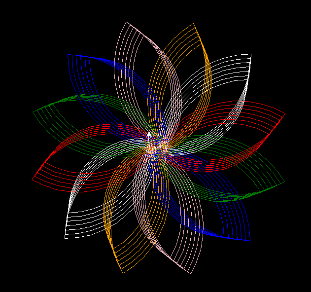

## [Benzene.py](./Benzene.py)

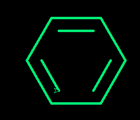

## [FourierSeriers.py](./FourierSerires.py)

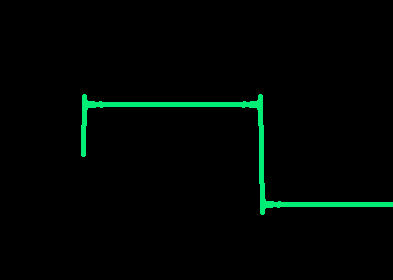

## [penta_clr.py](./penta_clr.py)

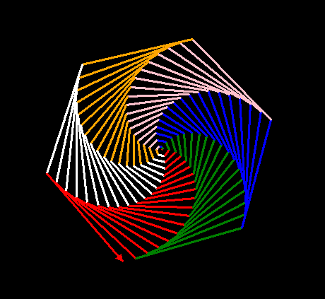

## [RandomClrs.py](./RandomClrs.py)

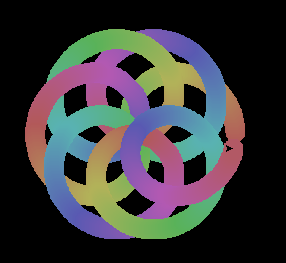

## [Shapes.py](./Shapes.py)

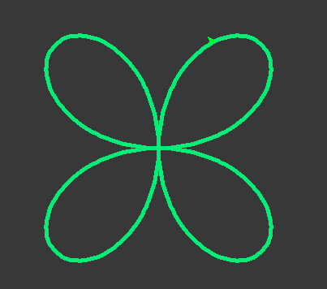

## [sphere.py](./sphere.py)

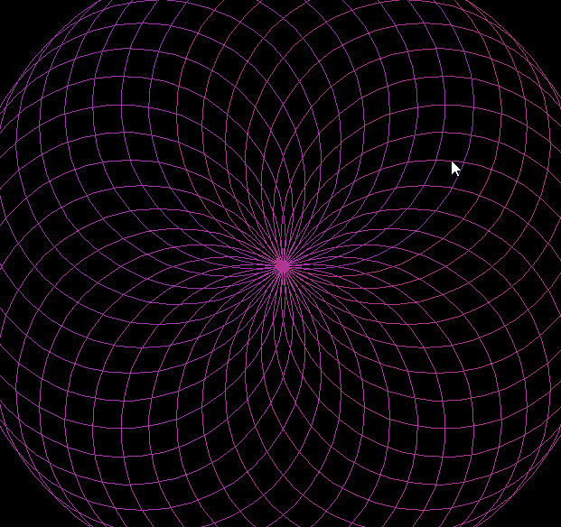

## [star.py](./star.py)

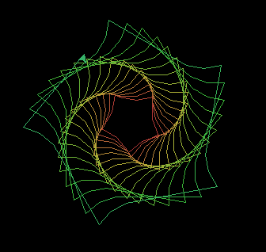

## [star_1.py](./star_1.py)

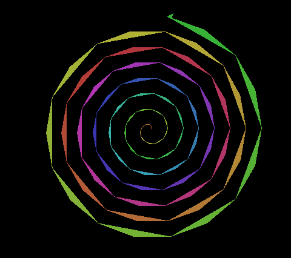

## [star_self.py](./star_self.py)

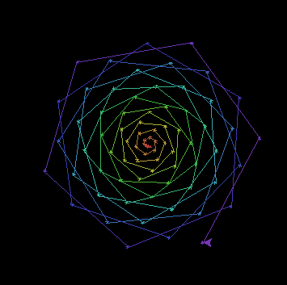

## [star_skele.py](./star_skele.py)

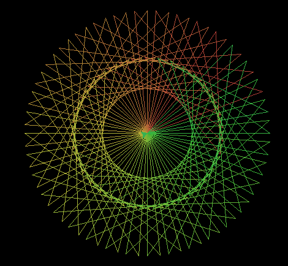

## [tri.py](./tri.py)

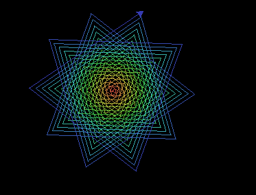

## [tri_self.py](./tri_self.py)

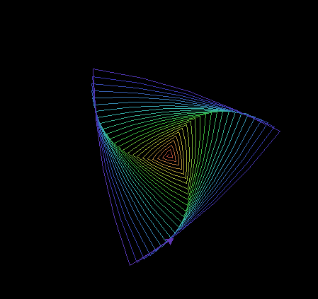

## [triangle.py](./triangle.py)

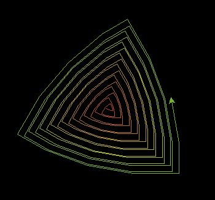
