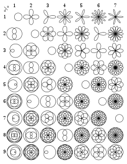

## Stay

Making the window stay after the drawing

```python
import turtle

turtle.mainloop()
```

## Forward

Moves forward a set distance
Usage:

```python
import turtle

# forward(dis)
turtle.forward(100)
```

## Back

Moves back a set distance

```python
import turtle
# back(dis)
turtle.back(100)
```

## Right

Moves a certain angle to the right of the current position

```python
import turtle
# right(angle)
turtle.right(90)
```

## Left

Moves a certain angle to the left of the current position

```python
import turtle
# left(angle)
turtle.left(90)
```

## Radians to degree

180/π

## Sorthand notations

- forward -> fd
- backward -> bk
- right -> rt
- left -> lt

## goto

Draws a line from the current position to the given co-ordinates
alternative : > setposition(x, y)
-> goto(x, y)

```python
import turtle
turtle.goto(100, 100)
```

## up down

-> lifts the pen up and down resulting in not drawing the shape
-> followed by down resulting in drawing the shape.

```python
import turtle

turtle.up()
turtle.down()
```

## Drawing a circle self method

```python
# Task draw a circle

#  x^2 + y^2 = r^2
# Parametric
# x = r cos(a)
# y = r sin(a)

r = 30

# (r, 0)
turtle.up()
turtle.setposition(r, 0)
turtle.down()

for angle in range(360):
    a = (pi / 180) * angle
    x = r * cos(a)
    y = r * sin(a)

    turtle.goto(x, y)
```

## Circle

Draws a circle

```python
import turtle
# circle(radius)
turtle.circle(30)
```

## Drawing an n sided polygon

```python
import turtle

side_length = 100
n = int(input("Enter the n sided polygon you want : "))

# external angle property
angle = 180 - ((n - 2) * 180) / n
# n sided polygon
for i in range(n):
    turtle.fd(side_length)
    turtle.lt(angle)
```

# Colors

- Hex representation.
- Predefined colors.

## changing screen color

```python
import turtle
turtle.Screen().bgcolor("SpringGreen2")
```

## Changing pen color

```python
import turtle
turtle.pencolor('red')
```

## Pen speed

```python
import turtle
turtle.speed(20)
```

## Pen size

```python
import turtle
turtle.pensize(3)
```

## Fill 
Fills a closed shape 
```python
import turtle 
turtle.fill("#fff")
turtle.begin_fill()

turtle.circle(30)

turtle.end_fill()
```

## Drawing heart 

```python
import turtle
from math import pi, cos, sin

turtle.pencolor("#f00")
turtle.fillcolor("#f00")
turtle.begin_fill()

r = 5
for i in range(360):
    a = i*(pi/180)

    x = r * 16 * pow(sin(a), 3) - 10;
    y = r * (13 * cos(a) - 5 * cos(2 * a) - 2 * cos(3 * a) - cos(4 * a));
    
    turtle.goto(x, y)

turtle.end_fill()

turtle.mainloop()
```

## Clover
Three leafed clover
```python
import turtle
from math import pi, cos, sin

turtle.pencolor("#0f0")
turtle.fillcolor("#0f0")
turtle.begin_fill()

size = 15
for i in range(360):
    a = i*(pi/180)

    part_a = sin((3 * a) / 2);
    part_b = sin((9 * a) / 2) / 5;
    r = pow(size * (part_a + part_b), 2);

    x = r * cos(a);
    y = r * sin(a);

    turtle.goto(x, y)

turtle.end_fill()

turtle.mainloop()
```

## Rose curves

k = n/ d
$ {\displaystyle r=a\cos(k\theta )} $ 

$ {\displaystyle x=r\cos(\theta )  } $
$ {\displaystyle y=r\sin(\theta )  } $

```python 
import turtle
from math import pi, cos, sin

turtle.pencolor("SpringGreen2")
turtle.fillcolor("#0f0")
# turtle.begin_fill()

# Rose curves
# k = n/ d
# r=a cos(k\θ)

# x = r cos(θ)
# y = r sin(θ)
turtle.bgcolor("#383838")
turtle.pensize(5)
turtle.speed(20)
turtle.up()

shape_size = 10

k = 5/ 4

for i in range(1, 4*360):
    a = i  * (pi/ 180)
    A = 10;
    r = shape_size * A * cos(k * a);
    x = r * cos(a);
    y = r * sin(a);

    turtle.goto(x, y)
    turtle.down()

# turtle.end_fill()

turtle.mainloop()
```



## Star

```python
import turtle
from math import pi, cos, sin

turtle.pencolor("SpringGreen2")
turtle.fillcolor("#0f0")
# turtle.begin_fill()

# Rose curves
# k = n/ d
# r=a cos(k\θ)

# x = r cos(θ)
# y = r sin(θ)
turtle.bgcolor("#383838")
turtle.pensize(5)
turtle.speed(20)
turtle.up()

shape_size = 10

for i in range(1, 4*360):
    a = i * (pi/ 180)

    x = 4 * cos(a) + cos(4 * a);
    x *= shape_size;

    y = 4 * sin(a) - sin(4 * a);
    y *= shape_size;

    turtle.goto(x, y)
    turtle.down()

# turtle.end_fill()

turtle.mainloop()
```

## Star 
```python
import turtle
from math import pi, cos, sin

turtle.pencolor("SpringGreen2")
turtle.fillcolor("#0f0")
# turtle.begin_fill()

# Rose curves
# k = n/ d
# r=a cos(k\θ)

# x = r cos(θ)
# y = r sin(θ)
turtle.bgcolor("#383838")
turtle.pensize(5)
turtle.speed(20)
turtle.up()

shape_size = 10

for i in range(1, 4*360):
    a = i * (pi/ 180)

    x = pow(pow(shape_size, 0.8) * cos(a), 3);
    y = pow(pow(shape_size, 0.8) * sin(a), 3);

    turtle.goto(x, y)
    turtle.down()

# turtle.end_fill()

turtle.mainloop()
```

## Butterfly

```python
import turtle
from math import pi, cos, sin

turtle.pencolor("SpringGreen2")
turtle.fillcolor("#0f0")
# turtle.begin_fill()

# Rose curves
# k = n/ d
# r=a cos(k\θ)

# x = r cos(θ)
# y = r sin(θ)
turtle.bgcolor("#383838")
turtle.pensize(5)
turtle.speed(20)
turtle.up()

shape_size = 10

for i in range(1, 4*360):
    a = i * (pi/ 180)

    # x = cos(a) (6sin(a) ^ 2)
    x = cos(a) * pow((sin(a) * 6), 2)
    y = sin(a) * pow((-cos(a) * 6), 2)

    x *= shape_size;
    y *= shape_size;

    turtle.goto(x, y)
    turtle.down()

# turtle.end_fill()

turtle.mainloop()
```

